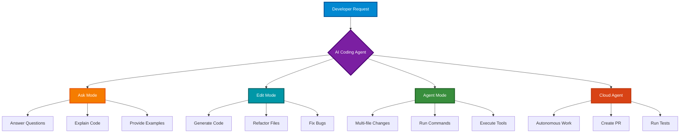
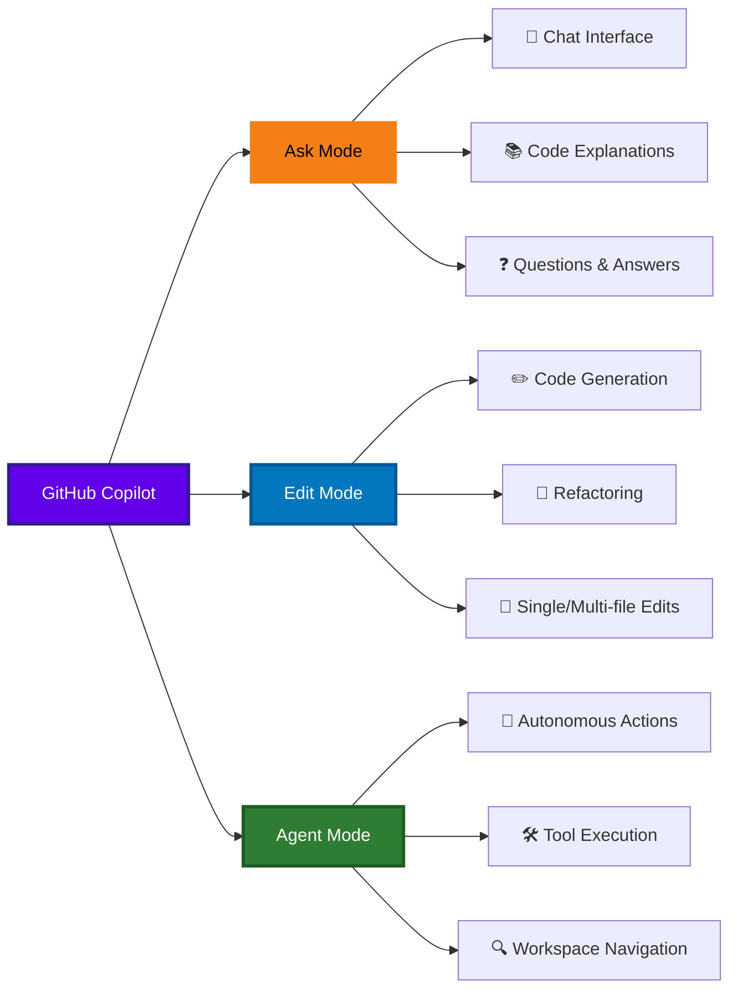
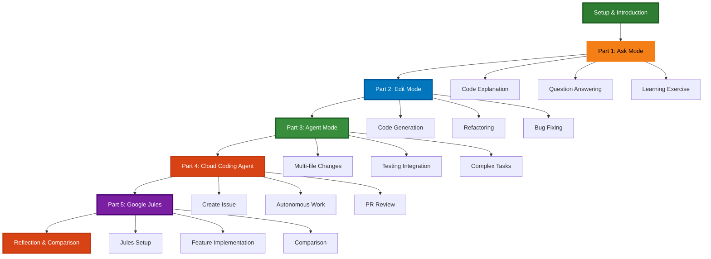
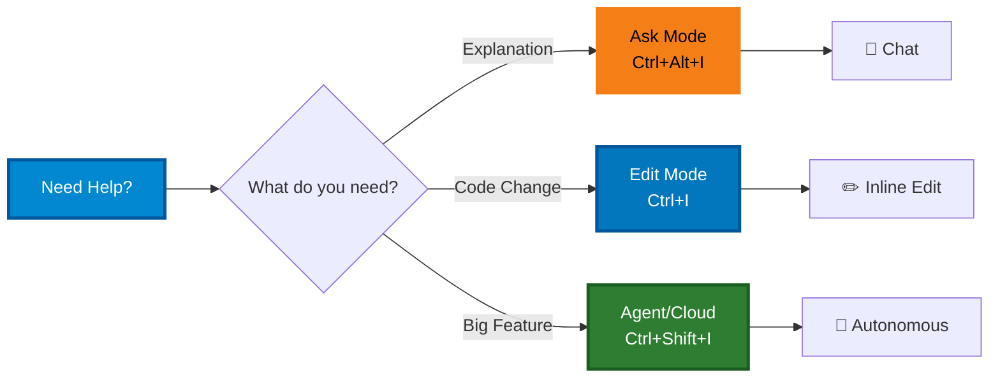

# AI Coding Agents Lab

## Overview
In this 2-hour lab, you will explore and compare different AI coding agents, learning how they assist developers through various interaction modes. You'll work hands-on with GitHub Copilot's three modes (Ask, Edit, and Agent) and experiment with cloud-based autonomous coding agents.

### What are AI Coding Agents?
AI coding agents are intelligent assistants that help developers write, understand, and modify code. Unlike simple code completion tools, modern coding agents can:
- Understand natural language instructions
- Navigate entire codebases
- Make multi-file changes
- Run tests and fix errors autonomously
- Create pull requests with complete implementations



### The Three Modes of GitHub Copilot



**Ask Mode** - Conversational assistance:
- Answer coding questions
- Explain existing code
- Provide code examples
- Suggest best practices
- No direct code editing

**Edit Mode** - Direct code modification:
- Generate new code
- Modify existing files
- Refactor code
- Apply changes directly to files
- Single or multiple file edits

**Agent Mode** - Autonomous task execution:
- Break down complex tasks
- Navigate workspace autonomously
- Execute terminal commands
- Run tests and validate changes
- Multi-step problem solving

### Learning Objectives
By the end of this lab, you will be able to:
- Distinguish between Ask, Edit, and Agent modes
- Use each Copilot mode effectively for different tasks
- Leverage cloud coding agents for autonomous development
- Compare different AI coding assistants (GitHub Copilot vs Google Jules)
- Understand when to use each type of agent
- Evaluate agent-generated code critically

## 1. 🚀 Quick Start
1. **Verify GitHub Copilot Access**: Ensure you have GitHub Copilot enabled
2. **Open in Codespace**: Click "Code" → "Create codespace on main"
3. **Wait for Setup**: Codespace will configure automatically
4. **Verify Copilot**: Check the Copilot icon in the bottom-right status bar
5. **Start Learning**: Begin with Part 1

## 2. 🛠️ Setup (5 minutes)

### Verify GitHub Copilot is Active
Look for the Copilot icon in the VS Code status bar (bottom right). It should show as active.

### Open Copilot Chat
- Press `Ctrl+Alt+I` (Windows/Linux) or `Cmd+Alt+I` (Mac)
- Or click the chat icon in the sidebar

### Test Copilot
In the chat, type:
```
Hello! Are you working?
```

You should get a response from Copilot.

## 3. 📚 Lab Structure



---

_Continue to the full lab content by following the exercises in each part folder..._

## Quick Reference Card



**Keyboard Shortcuts:**
- `Ctrl+Alt+I` - Open Copilot Chat (Ask Mode)
- `Ctrl+I` - Inline Copilot (Edit Mode)
- `Ctrl+Shift+I` - Copilot Edits (Agent Mode)
- `Ctrl+Enter` - Accept suggestion
- `Esc` - Reject suggestion

---
