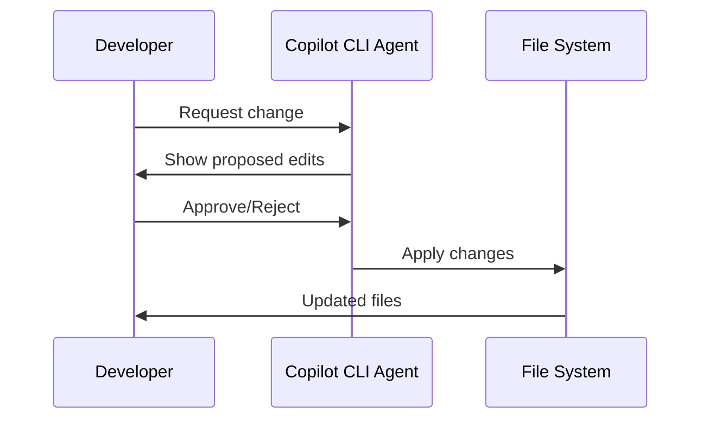
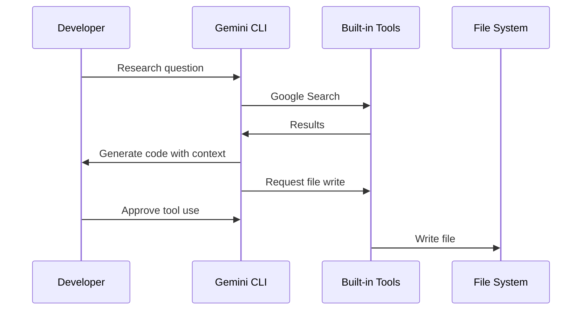
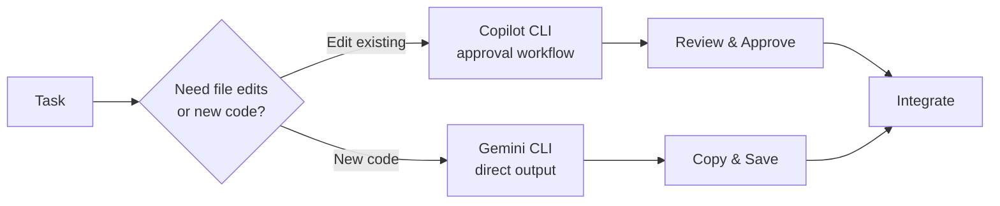
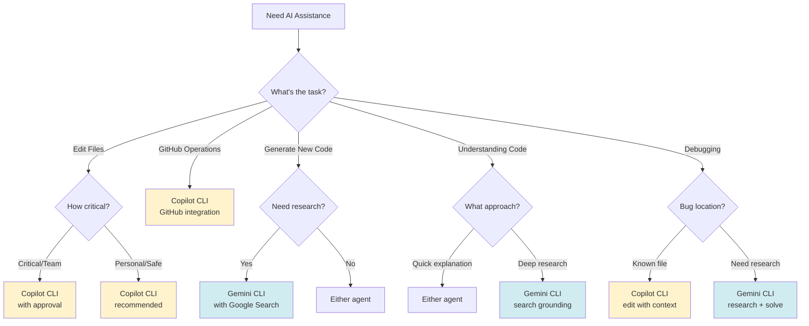

# Part 8: Advanced Features & Comparison (25 minutes)

Explore advanced use cases, compare tools effectively, and develop strategies for choosing the right tool.

## Overview

In this section, you'll:
- Learn workflow integration patterns
- Build a decision framework for tool selection
- Complete real-world scenarios using appropriate tools
- Develop best practices for CLI agent usage

## Part 3.1: Workflow Integration Patterns (10 minutes)

### Pattern 1: Interactive Agent for File Operations

**Use Case:** File editing and GitHub operations with approval workflow



**Example:**
```bash
# Start interactive agent
copilot

# Request within session
> Refactor utils.py to use type hints
# Agent shows diff
# You approve
# File is updated

> Create unit tests for the refactored code
# Agent shows new file
# You approve
# test_utils.py is created
```

**When to use:**
- Editing existing files
- Multi-file refactoring
- GitHub operations (PR, commits)
- When safety/review is important

### Pattern 2: Research-Focused Agent with Tools

**Use Case:** Code generation with research and multi-tool capabilities



**Example:**
```bash
# Start interactive agent
gemini

# Agent can research and generate
You: Create a Python script to parse log files using modern best practices
# Agent may search for current libraries
# Shows proposed approach with context

You: Add filtering by date range
# Agent updates the solution

You: Write this to log_parser.py
# Agent requests file write permission
# You approve
# File is created

You: Create unit tests
# Agent generates tests
```

**When to use:**
- Need research before coding
- Want multi-tool capabilities
- Generating standalone scripts
- When Google Search context helps

### Pattern 3: Hybrid Agent Approach

**Use Case:** Complex projects leveraging both agent strengths



**Example Scenario:** Refactor project with new features

```bash
# Use Copilot CLI for editing existing files
copilot
> Refactor main.py to use async/await
> Update tests in test_main.py for async code
# Review and approve each change

# Use Gemini CLI for researching and generating new utilities
gemini
You: Research best practices for async logging in Python, then create an async logger utility class
# Agent researches, then generates code
# Agent asks to write file
# You approve

You: Create a configuration loading helper
# Agent generates and writes file
# Combine both outputs in your project
```

**When to use:**
- Large refactoring projects
- Adding features to existing codebase
- When you need both safety (edits) and speed (new code)
- Team projects (use approval workflow for shared code)

## Part 3.2: Agent Selection Decision Tree (5 minutes)

Use this decision tree to choose the right agent:



### Quick Reference Table

| Scenario | Agent | Why |
|----------|-------|-----|
| Refactor existing file | **Copilot CLI** | Approval workflow for safety |
| Create new Python class | **Gemini CLI** | Research + generation |
| Update multiple files | **Copilot CLI** | Multi-file context + review |
| Debug Python error | **Either** | Both support debugging |
| Create GitHub PR | **Copilot CLI** | GitHub integration |
| Build REST API client | **Gemini CLI** | Research best practices first |
| Edit shared team code | **Copilot CLI** | Approval prevents accidents |
| Research + prototype | **Gemini CLI** | Google Search grounding |

## Part 3.3: Real-World Scenarios (10 minutes)

Explore these realistic scenarios using the appropriate tool(s). Focus on learning which tool works best for different situations.

### Scenario 1: Emergency Debugging 🚨

**Situation:** Production server is running out of disk space.

**Tasks:**
1. Find what's using the most space
2. Identify large log files to clean up
3. Create a safe cleanup script

**Your Solution:**

Experiment with both agents to solve this problem. Try different approaches and see what works best.

### Scenario 2: Repository Cleanup 🧹

**Situation:** Git repository has become messy with old branches.

**Tasks:**
1. Find branches not merged to main
2. Identify branches not touched in 6 months
3. Create a safe cleanup script
4. Document the process

**Your Solution:**

Try using Copilot CLI for GitHub operations and Gemini CLI for scripting. Compare the approaches.

### Scenario 3: Data Processing Pipeline 🔄

**Situation:** Need to process CSV files automatically.

**Tasks:**
1. Watch directory for new CSV files
2. Validate data format
3. Process and transform data
4. Move processed files to archive
5. Log all operations
6. Handle errors gracefully

**Your Solution:**

This benefits from both agents - explore how to combine their strengths.

## Part 3.4: Side-by-Side Agent Comparison (5 minutes)

Complete the same task with both agents and compare workflows.

### Task: Log File Analyzer

**Requirements:**
- Count ERROR, WARN, INFO levels
- Show top 5 most common errors
- Output summary report

### With GitHub Copilot CLI (Approval Workflow)

```bash
# Start interactive session
copilot

# Within the session:
> Create a Python script called log_analyzer.py that counts ERROR, WARN, INFO levels and shows top 5 errors

# Agent shows you the complete file content
# You review the proposed code
# Approve or request changes
# File is created automatically
```

**Observe:**
- How the agent presents the code
- The approval workflow
- File creation process
- Session context retention

### With Gemini CLI (Interactive Agent)

```bash
# Start interactive agent
gemini

# Within the session:
You: Create a Python script called log_analyzer.py that counts ERROR, WARN, INFO levels and shows top 5 errors

# Agent generates code and may ask to write file
# Agent may research best practices first
# You approve tool usage (file write)
# File is created
```

**Observe:**
- Interactive conversation
- Tool approval workflow (write files)
- Research capabilities (Google Search)
- Multi-tool coordination

## Best Practices Summary

### For GitHub Copilot CLI

✅ **Do:**
- Use for editing existing files (approval workflow)
- Leverage GitHub integration for PRs and commits
- Review diffs carefully before approving
- Use for multi-file refactoring
- Take advantage of session context

❌ **Don't:**
- Approve changes without reviewing
- Use for quick code snippets (Gemini is faster)
- Skip reading the proposed diffs
- Forget about session persistence

### For Gemini CLI

✅ **Do:**
- Use for research-backed code generation
- Leverage Google Search grounding
- Approve tool usage carefully
- Use for exploration and learning
- Take advantage of built-in tools
- Ask for explanations and context

❌ **Don't:**
- Approve file operations without review
- Forget to check generated code
- Use for critical file edits (use Copilot)
- Skip understanding tool approvals
- Ignore research context provided

### Universal Best Practices

1. **Always Review** - Never run AI-generated code/commands without review
2. **Understand First** - Make sure you understand what it does
3. **Test Safely** - Test in non-production environments
4. **Version Control** - Commit working code before AI experiments
5. **Document** - Record what works and what doesn't
6. **Iterate** - Refine prompts and outputs
7. **Learn** - Use AI as a teacher, not just a tool
8. **Verify** - Check outputs for correctness

## Key Takeaways

After completing Part 3, you should:

✅ Understand workflow integration patterns  
✅ Know when to use which tool  
✅ Have experience with real-world scenarios  
✅ Recognize strengths and limitations  
✅ Developed best practices for CLI agents  

## Lab Complete! 🎉

You've successfully explored both GitHub Copilot CLI and Google Gemini CLI. You now have hands-on experience with:

- Installing and configuring CLI coding agents
- Using conversational interfaces for code generation
- Understanding different approval workflows
- Comparing agent capabilities and choosing the right tool
- Building real-world applications through agent conversations

**Key Takeaways:**
- **GitHub Copilot CLI**: Best for GitHub-integrated workflows, safe file editing with approval
- **Google Gemini CLI**: Best for research-backed development, multi-tool automation
- **Both tools**: Free tiers available, npm-based installation, conversational interfaces

---

**Time Check:** You should have spent about 25 minutes on this section.

## Bonus: Advanced Techniques (Optional)

### Technique 1: Complementary Agent Usage

Use both agents for their strengths:

```bash
# Use Copilot CLI to refactor existing code
copilot
> Refactor utils.py to add type hints
# Review and approve

# Use Gemini CLI for research-backed generation
gemini
You: Research best practices for config loaders, then create one for Python
# Agent researches, generates, writes file
# You approve tool usage

# Both agents complement each other!
```

### Technique 2: Custom Aliases

```bash
# In ~/.bashrc or ~/.zshrc
alias ai='copilot'     # Quick Copilot access
alias aig='gemini'     # Quick Gemini access
alias air='gemini'     # Gemini with research focus
alias aicode='python /path/to/gemini_cli.py' # Quick Gemini access
alias aii='python /path/to/gemini_cli.py -i' # Gemini interactive
```

### Technique 3: Session Logging

Track your AI agent usage:

```bash
# Both CLIs maintain session logs
# Copilot CLI: ~/.config/copilot/
# Gemini CLI: Check ~/.config/gemini/ or similar

# Review recent sessions to learn patterns
```

---

**Lab Complete!** You've finished all parts of the CLI Coding Agents Lab. Great work! 🚀
