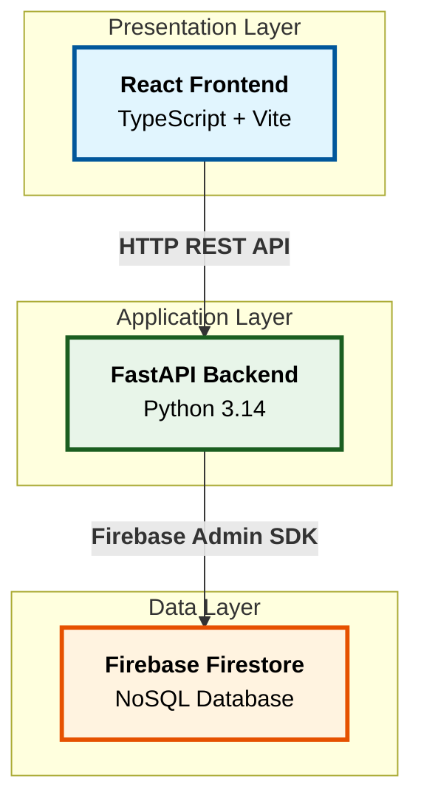
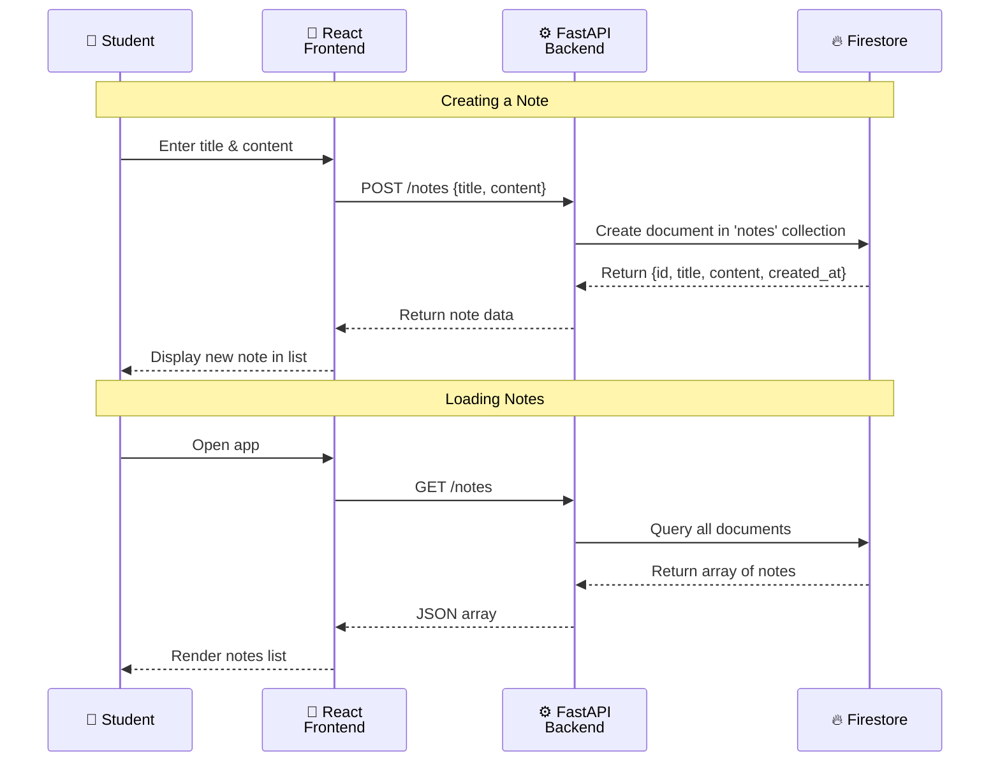
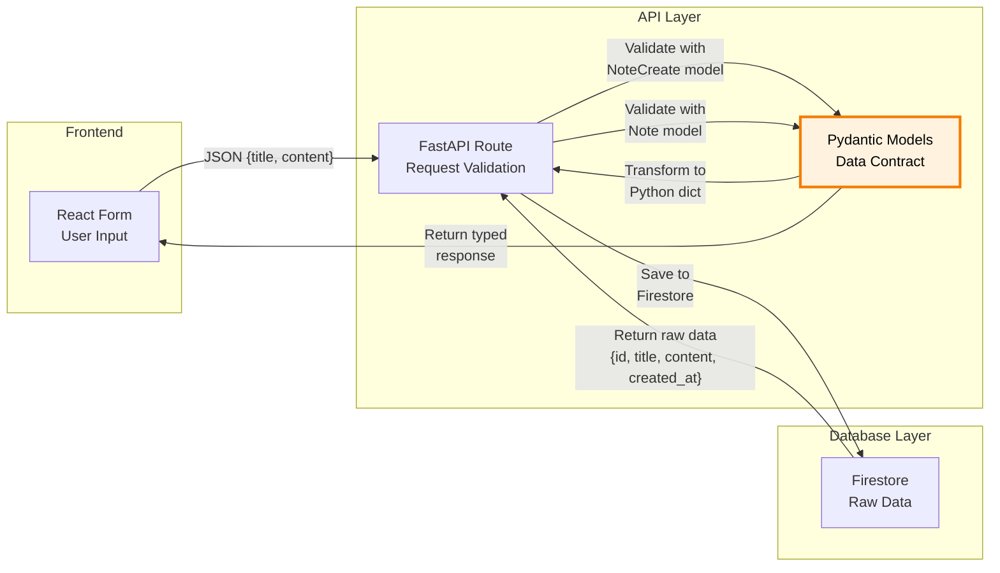
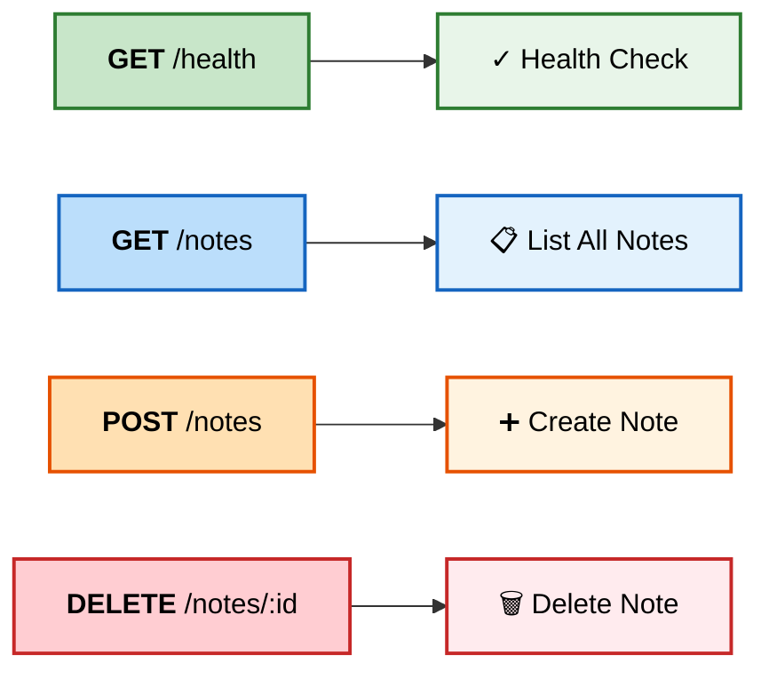

# BaaS Lab - Firebase DB

---

Welcome to the BaaS (Backend as a Service) Lab. In this hands-on lab, you'll build a simple note-taking application. Will will be using the FastAPI Framework (Python) for our frontend. FastAPI is a modern web framework for building HTTP-based service APIs in Python. We will be using React (TypeScript) for our business logic server, and Firebase Firestore DB. The focus is on learning **how to use AI (GitHub Copilot) to assist you** in building and connecting a full-stack application.

---

## 🧭 What You'll Build
- A FastAPI backend with REST endpoints for creating, listing, and deleting notes
- A React frontend with a clean note-taking interface
- Firebase Firestore integration for cloud data persistence
- Hands-on experience using GitHub Copilot to write, debug, and enhance code
- Understanding of how to connect frontend, backend, and cloud services

---

## 🗂️ Table of Contents
1. [What You'll Learn](#what-youll-learn)
2. [Prerequisites](#prerequisites)
3. [Quick Setup](#quick-setup-5-minutes)
4. [Project Structure](#project-structure)
5. [Part 1: Verify the Setup](#part-1-verify-the-setup-10-minutes)
6. [Part 2: Firebase Configuration](#part-2-firebase-configuration-15-minutes)
7. [Part 3: Using AI to Build Features](#part-3-using-ai-to-build-features-20-minutes)
8. [Part 4: Enhancement Exercises](#part-4-enhancement-exercises-15-minutes)
9. [Troubleshooting](#troubleshooting)
10. [Next Steps](#next-steps)

---

## Architecture Overview

### 3-Tier Architecture



### Why FastAPI?

FastAPI serves two critical purposes in this architecture:

**1. Secure API for React Frontend** 🎯 **Primary Purpose**
- React runs in the browser and needs a backend API to communicate with
- FastAPI provides REST endpoints (`GET /notes`, `POST /notes`, `DELETE /notes`) that React can call via HTTP requests
- Handles CORS (Cross-Origin Resource Sharing) so the browser allows the requests

**2. Secure Firebase Integration** 🔐 **Secondary Purpose**
- Firebase service account credentials must never be exposed in frontend code (they'd be visible to users!)
- FastAPI runs server-side and securely holds the Firebase credentials
- Acts as a trusted intermediary between the frontend and Firebase database

**Without FastAPI**: You'd have no way for React to communicate with Firebase securely. The frontend would either need direct database access (insecure) or you'd need another backend service.

### Layer Responsibilities

- **Presentation Layer**: React frontend (TypeScript, HTML, CSS) - what users see and interact with
- **Application Layer**: FastAPI backend (Python code) - business logic, API endpoints, data validation
- **Data Layer**: Firebase Firestore (NoSQL database) - persistent data storage, not Python code

---

### Request Flow



---

## What You'll Learn
- **FastAPI fundamentals**: Building REST APIs with Python
- **React with TypeScript**: Modern frontend development with hooks
- **Firebase Firestore**: Cloud NoSQL database integration
- **AI-assisted development**: Using GitHub Copilot effectively
- **Full-stack integration**: Connecting frontend, backend, and database
- **API design**: RESTful endpoints and data modeling

---

## Quick Setup

### 1. Launch Codespace
- Click the green "Code" button → "Create codespace on main"
- Wait for the dev container to build (includes Python 3.14, Node.js, and all tools)

### 2. Verify GitHub Copilot
- Look for the Copilot icon in the bottom-right status bar
- If it says "Sign in", click and authenticate

### 3. Install Backend Dependencies
```bash
cd $CODESPACE_VSCODE_FOLDER/backend
pip install -r requirements.txt
```

### 4. Install Frontend Dependencies
```bash
cd $CODESPACE_VSCODE_FOLDER/frontend
npm install
```

---

## Project Structure

```
backend/
  app/
    main.py          # FastAPI routes (GET /notes, POST /notes, DELETE /notes)
    schemas.py       # Pydantic models (Note, NoteCreate)
    firestore.py     # Database helpers (with TODO comments for AI assistance)
  tests/
    test_routes.py   # Unit tests

frontend/
  src/
    components/
      NoteForm.tsx   # Form to create notes
      NoteCard.tsx   # Display individual note with delete button
      NoteList.tsx   # List all notes
    api.ts           # API client functions
    main.tsx         # React app entry point
    firebase.ts      # Firebase configuration
```

### Data Flow & Validation



**Pydantic Models as Data Contracts** 📋
- **Request Contract**: `NoteCreate` defines what the frontend must send
- **Response Contract**: `Note` defines what the frontend will receive  
- **Validation Rules**: Enforce data quality before it reaches Firestore
- **Type Safety**: Python gets strongly-typed data, not raw JSON
- **API Documentation**: Automatic OpenAPI schema generation at `/docs`

**Without Pydantic**: Raw JSON flows between layers with no validation or type safety.

### API Endpoints



**Key Feature**: The code is already functional! You'll use AI to understand it and add enhancements.

---

## Part 1: Verify the Setup

### Step 1: Test the Backend

We have prepared a script to start the backend server and handle configuration.

```bash
./start-backend.sh
```

You should see:
```
🚀 Starting FastAPI Backend Server...
...
INFO:     Uvicorn running on http://127.0.0.1:8000
```

**Test the health endpoint** (in a new terminal):
```bash
curl http://localhost:8000/health
# Should return: {"status":"ok"}
```

**View the API docs**: 
- Open http://localhost:8000/docs
- **If that doesn't work**: Go to the **Ports** tab in VS Code, click the "Globe" icon next to port 8000, and add `/docs` to the URL.

Press `Ctrl+C` to stop the server.

### Step 2: Run the Tests

```bash
cd $CODESPACE_VSCODE_FOLDER
python -m pytest backend/tests/ -v
```

You should see tests passing.

### Step 3: Start the Frontend

We have a script to start the frontend that automatically configures the API connection for Codespaces.

```bash
./start-frontend.sh
```

Open http://localhost:5173 - you should see "Firebase Notes" with a form.

**Note**: The app won't save notes yet (we need Firebase). That's coming next!

---

## Part 2: Firebase Configuration

### Step 1: Create Firebase Project

1. Go to [Firebase Console](https://console.firebase.google.com/)
2. Click **"Add project"** → Name it `notes-lab-<your-name>`
3. Enable Gemini in Firebase
4. **Disable Google Analytics** (faster setup)
5. Click **"Create project"**

### Step 2: Create Firestore Database

Open Gemini and ask it to give you the exact steps to install a no sql database in your project using the Firebase web console or follow the commands below:

1. Click on **Build** dropdown in the left menu and click on **"Firestore Database"**
2. Click **"Create database"**
3. Select **Standard edition** then click Next
4. Choose a region (e.g., `europe-west2 (London)` or nearest to you)
5. Select **"Start in test mode"** (allows open access for learning) and click **"Create"**

### Step 3: Get Service Account Key

The backend needs credentials to access Firestore:

1. In the top left, click on the gear icon, to the right of Project Overview then select **Project Settings**
2. Click on the **Service accounts** tab
3. Select **Python**
4. Click **"Generate new private key"**
5. Click **"Generate key"** - a JSON file downloads
6. Take a look in the downloaded JSON file

**Upload the key to your Codespace:**
1. In VS Code file explorer, right-click `backend` folder → **Upload**
2. Select the downloaded JSON file
3. Right click on the file and Rename it to `firebase-service-account.json`

**Run the following command in the terminal to verify it's there:**
```bash
if [ -f "$CODESPACE_VSCODE_FOLDER/backend/firebase-service-account.json" ]; then
    echo -e "\033[0;32mSuccess: your configuration file exists\033[0m"
else
    echo -e "\033[0;31mError: configuration file not found\033[0m"
fi
```

### Step 4: Set Environment Variable

Tell the backend where to find the credentials:

```bash
export GOOGLE_APPLICATION_CREDENTIALS="$CODESPACE_VSCODE_FOLDER/backend/firebase-service-account.json"
```

**Verify it's set correctly:**
```bash
echo $GOOGLE_APPLICATION_CREDENTIALS
```

**Make it permanent** (survives terminal restarts):
```bash
echo 'export GOOGLE_APPLICATION_CREDENTIALS="$CODESPACE_VSCODE_FOLDER/backend/firebase-service-account.json"' >> ~/.bashrc
source ~/.bashrc
```

### Step 5: Add to .gitignore

**Critical**: Never commit credentials to git!

```bash
echo "backend/firebase-service-account.json" >> .gitignore
```

### Step 6: Test the Connection

We have a master script that starts both servers and sets up all the necessary environment variables for you.

**Run the start-everything script:**
```bash
./start-everything.sh
```

This will:
1. Set up your Firebase credentials
2. Configure the frontend to talk to the backend
3. Start both servers
4. Print the URLs you need

**Test it:**
1. Open the Frontend URL (usually http://localhost:5173)
2. Create a note with a title and content
3. Go to Firebase Console → Firestore Database → Data
4. You should see a `notes` collection with your note!

> ℹ️ Firestore creates collections lazily. The `notes` collection appears only after the backend successfully writes the first document.

✅ If you see your note in Firebase, the integration works!

**To stop the servers:**
Run `./stop-everything.sh` or press `Ctrl+C` in the terminal where the script is running.

---

## Part 3: Using AI to Build Features

Now let's use GitHub Copilot to understand and enhance the code.

### Exercise 1: Understand the Backend

Open `backend/app/firestore.py` and read the TODO comments.

**Ask Copilot Chat:**
```
Explain how the list_notes function works. What does it return?
```

**Try inline completion:**
- Place your cursor after a TODO comment
- Start typing a function implementation
- Watch Copilot suggest the complete code

### Exercise 2: Add Input Validation

**Prompt for Copilot Chat:**
```
In backend/app/schemas.py, update the Note model to ensure:
- title is between 3 and 100 characters
- content is between 10 and 5000 characters
```

**Apply the changes** and restart the backend server.

**Test it:**
```bash
curl -X POST http://localhost:8000/notes \
  -H "Content-Type: application/json" \
  -d '{"title":"Hi","content":"Short"}'
```

You should see a validation error!

### Exercise 3: Add an Edit Feature

This is a bigger challenge. Use Copilot to help you:

**Step 1: Add backend endpoint**

**Copilot Prompt:**
```
In backend/app/main.py, add a PATCH /notes/{note_id} endpoint that accepts title and content updates
```

**Step 2: Add Firestore helper**

**Copilot Prompt:**
```
In backend/app/firestore.py, add an update_note function that updates an existing note by ID
```

**Step 3: Add frontend edit button**

**Copilot Prompt:**
```
In frontend/src/components/NoteCard.tsx, add an Edit button that shows an inline form to update the note
```

**Test the edit feature** by:
1. Creating a note
2. Clicking the Edit button
3. Changing the text
4. Verifying it updates in Firebase

---

## Part 4: Enhancement Exercises

Choose one or more exercises to practice with AI:

### Exercise A: Add Search

**Copilot Prompts:**
1. "Add a search input in the main App component"
2. "Filter notes by title matching the search query"
3. "Highlight matching text in search results"

### Exercise B: Add Timestamps

**Copilot Prompts:**
1. "Show how long ago each note was created (e.g., '5 minutes ago')"
2. "Sort notes by creation date, newest first"

### Exercise C: Add Categories/Tags

**Copilot Prompts:**
1. "Add a category field to the Note model"
2. "Add a dropdown to select category when creating notes"
3. "Add filter buttons to show notes by category"

### Exercise D: Improve Styling

**Copilot Prompts:**
1. "Add modern CSS styling to NoteCard with shadows and hover effects"
2. "Make the app responsive for mobile devices"
3. "Add a dark mode toggle"

---

## Part 5: Firebase CLI Setup

Now let's set up the Firebase CLI tool which allows you to manage your Firebase projects from the terminal.

### Step 1: Install the CLI
In the terminal, run:
```bash
npm install -g firebase-tools
```

### Step 2: Login to Firebase
We need to authenticate the CLI with your Google account. Since we are in a Codespace, we use the `--no-localhost` flag.

```bash
firebase login --no-localhost
```
1. Type `Y` if asked to enable Gemini in Firebase features.
2. Type `Y` to allow data collection (optional).
3. Copy the long URL provided and paste it into a new browser tab.
4. Log in with your Google account and click "Allow".
5. Copy the authorization code shown in the browser.
6. Paste the code back into the terminal and press Enter.

### Step 3: Verify Connection
Let's check if the CLI can see your projects.

```bash
firebase projects:list
```
You should see a list of your Firebase projects, including the `notes-lab-<your-name>` project you created earlier.

### Step 4: Connect to Your Project
Link this local directory to your remote Firebase project.

```bash
firebase init firestore
```
1. Type `Y` to proceed if asked.
2. Select **Use an existing project**.
3. Select your `notes-lab-<your-name>` project.
4. Press **Enter** to accept `firestore.rules`.
5. Press **Enter** to accept `firestore.indexes.json`.

### Step 5: Test the CLI
Let's verify everything is working by deploying the default security rules.

```bash
firebase deploy --only firestore:rules
```
If you see "Deploy complete!", your CLI is correctly configured and talking to Firebase.

---

## Troubleshooting

- **"ModuleNotFoundError: No module named 'backend'"**: Run pytest from project root: `python -m pytest backend/tests/ -v`
- **"Address already in use"**: Kill existing server: `pkill -f uvicorn`
- **Backend won't start**: Check `GOOGLE_APPLICATION_CREDENTIALS` is set: `echo $GOOGLE_APPLICATION_CREDENTIALS`
- **"Permission denied" from Firebase**: Verify Firestore rules are set to test mode (open access)
- **Frontend can't reach backend**: 
  - Check backend is running on port 8000
  - Ensure port 8000 is **Public** in the "Ports" tab (Codespaces defaults to Private)
  - Refresh the page after changing port visibility
- **Notes not saving**: Check browser console for errors, verify Firebase rules, check network tab for 400/500 errors
- **Copilot not suggesting**: Sign in to GitHub in VS Code, verify active Copilot subscription

---

## Best Practices for AI-Assisted Development

### Effective Copilot Prompts
- **Be specific**: "Add error handling to the create_note function" beats "improve the code"
- **Include context**: "In the FastAPI backend, add input validation..."
- **Iterate**: Start with a simple prompt, then refine: "Now add a loading spinner"

### Code Review Checklist
- ✅ **Understand generated code** before accepting
- ✅ **Test every change** immediately
- ✅ **Check for security issues** (especially with Firebase rules)
- ✅ **Verify error handling** exists
- ✅ **Ensure proper types** (TypeScript, Pydantic)

### Learning Tips
1. **Read the generated code** line by line
2. **Ask "why"**: Use Copilot Chat to explain complex logic
3. **Experiment**: Try different prompts for the same task
4. **Document**: Note what prompts worked well in `notes.md`


---

## Success Criteria

You've completed the lab when:
- ✅ Backend serves 3 endpoints: GET/POST/DELETE /notes
- ✅ Frontend displays notes from Firestore
- ✅ Creating a note persists it to Firebase
- ✅ Deleting a note removes it from Firebase
- ✅ You understand how Copilot helped at each step
- ✅ (Bonus) You added at least one enhancement using AI

---

## What's Next?

### Extension Ideas
- **Authentication**: Add Firebase Auth so each user sees only their notes
- **Rich Text**: Use a Markdown or WYSIWYG editor for content
- **Attachments**: Upload images to Firebase Storage
- **Real-time Sync**: Use Firestore's `onSnapshot` to update UI without refreshing
- **Deploy**: Host frontend on Firebase Hosting, backend on Cloud Run

### Resources
- [FastAPI Documentation](https://fastapi.tiangolo.com/)
- [Firebase Firestore Docs](https://firebase.google.com/docs/firestore)
- [React Documentation](https://react.dev/)
- [GitHub Copilot Tips](https://docs.github.com/en/copilot)

---

## License

MIT License - feel free to use this lab for teaching or learning.

---

**Questions? Feedback?** Open an issue or contribute improvements!
