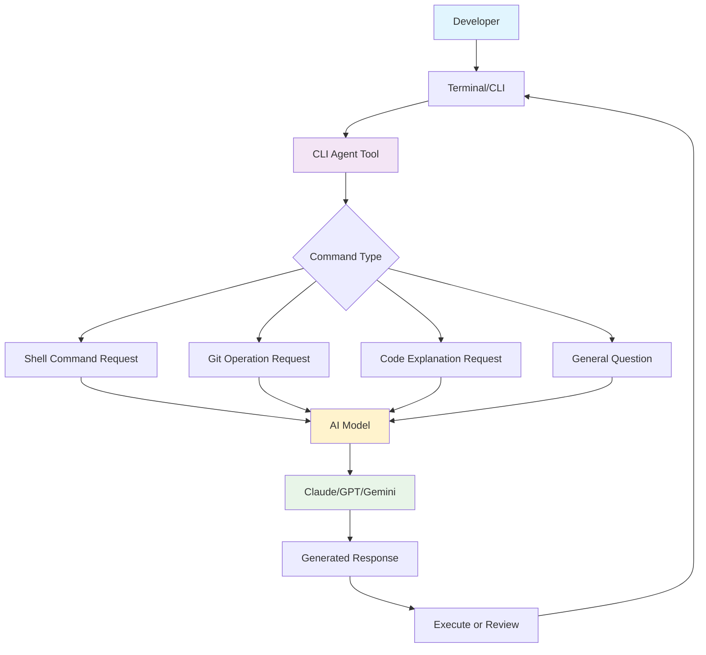
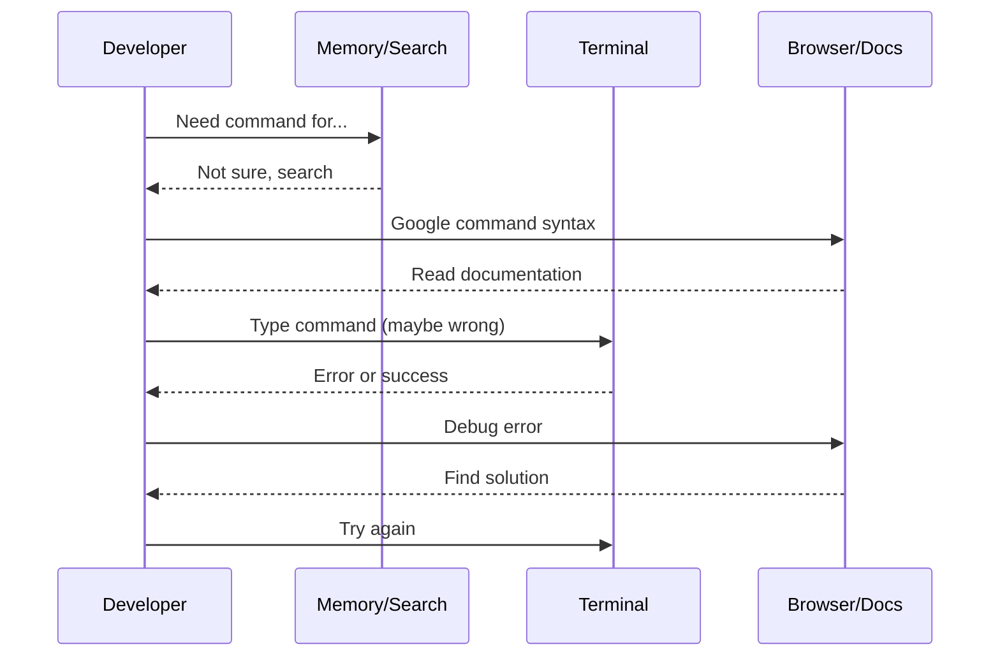
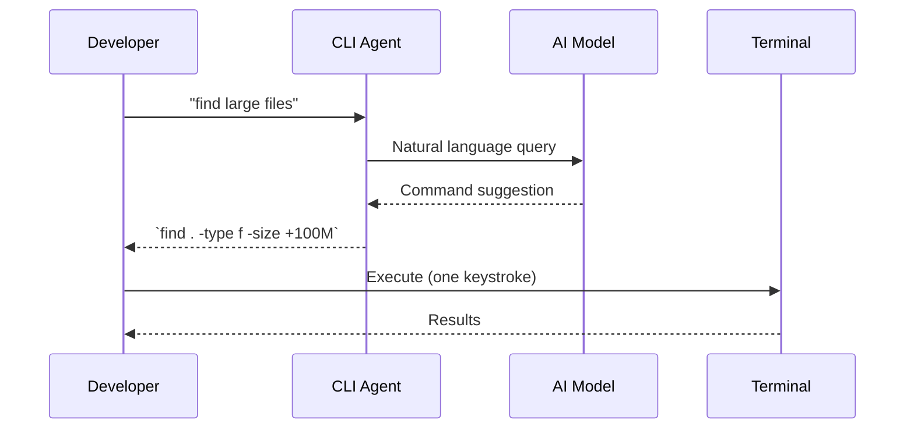
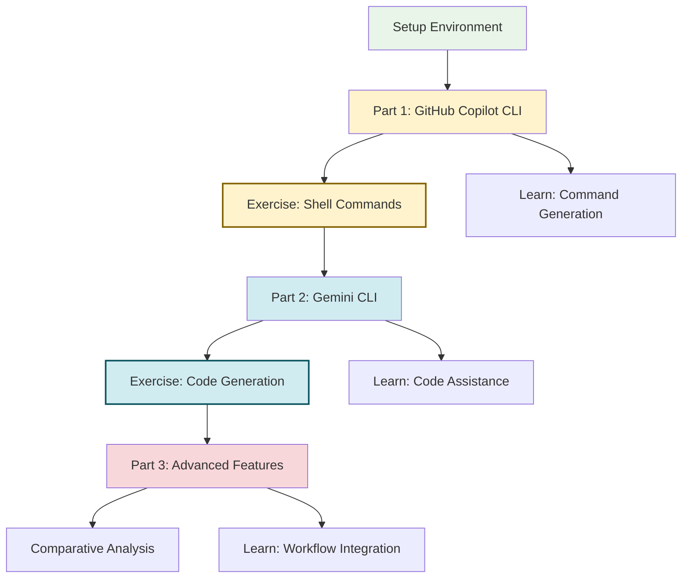

# CLI Coding Agents Lab

## Overview
In this 2-hour lab, you will learn how to use CLI-based AI coding agents to enhance your development workflow. You'll explore two powerful, free-to-use tools: GitHub Copilot CLI and Google Gemini CLI.

### What are CLI Coding Agents?
CLI coding agents are command-line interfaces that connect to AI models to help you with coding tasks directly from your terminal. They can:
- Generate shell commands from natural language
- Explain complex commands
- Debug code and errors
- Answer programming questions
- Assist with git operations
- Provide code suggestions and completions



### Why Use CLI Coding Agents?

**Traditional Workflow:**


**With CLI Coding Agents:**


### Tools We'll Use

#### 1. GitHub Copilot CLI
- **Cost:** Free with GitHub Copilot Pro. You can get GitHub Copilot free if you sign up for the GitHub Student Developer Pack.
- **Model:** Claude Sonnet 4.5, GPT-5, or Claude Haiku 4.5
- **Strengths:** 
  - Full terminal-based coding agent
  - Edits files directly with approval
  - GitHub context integration (repos, issues, PRs)
  - MCP server extensibility
  - Session persistence and task delegation

#### 2. Google Gemini CLI
- **Cost:** Free tier with Google account (60 req/min, 1000 req/day)
- **Model:** Gemini 2.5 Pro with 1M token context window
- **Package:** Official Google Gemini CLI (Apache 2.0 licensed)
- **Strengths:**
  - Built-in tools (Google Search, file operations, shell commands)
  - MCP server extensibility
  - Code understanding & generation
  - OAuth login or API key authentication
  - Non-interactive mode for scripting

### Learning Objectives
By the end of this lab, you will be able to:
- Install and configure terminal-based AI coding agents
- Use conversational interfaces to build and modify code
- Understand permission models and approval workflows
- Leverage GitHub context and MCP servers
- Compare agent architectures and capabilities
- Build custom workflows with CLI agents
- Make informed decisions about which agent to use for different tasks

## Prerequisites
- Basic command line experience (cd, ls, etc.)
- Git fundamentals
- A GitHub account (for Copilot CLI)
- A Google account (for Gemini CLI)

## 🗂️ Table of Contents
1. [Setup](#setup-15-minutes)
2. [Lab Structure](#lab-structure)
3. [Part 1: GitHub Copilot CLI](part1/README.md)
4. [Part 2: Google Gemini CLI](part2/README.md)
5. [Part 3: Advanced Features & Comparison](part3/README.md)
6. [Troubleshooting](TROUBLESHOOTING.md)
7. [AI Programming Best Practices](#-ai-programming-best-practices)

---

## Setup (15 minutes)

### 1. Install Node.js and npm
GitHub Copilot CLI requires Node.js v22+ and npm v10+.

```bash
# Update to the latest Node.js version 
curl -fsSL https://deb.nodesource.com/setup_current.x | sudo -E bash -
sudo apt install nodejs -y

# Update to the latest npm version
sudo npm install -g npm@latest

# Verify installation
node --version  # Should be v22 or higher
npm --version   # Should be v10 or higher
```

### 2. Install GitHub Copilot CLI

```bash
# Install globally via npm (may require sudo)
sudo npm install -g @github/copilot

# Verify installation
copilot --version
```

### 3. Authenticate with GitHub

```bash
# Launch copilot
copilot
# Then select option 2: Yes, and remember this folder for future sessions  
# Then add terminal bindings by selecting option 1: Yes 
```

Verify authentication:
```bash
copilot
# Should launch successfully without errors
# Type 'help' and copilot will show available commands
# Type /exit to quit
```

### 4. Install Google Gemini CLI

```bash
sudo npm install -g @google/gemini-cli
```

Verify installation:
```bash
gemini --version
```

### 5. Install Gemini CLI Companion Extension

The Gemini CLI Companion extension provides enhanced VS Code integration with the Gemini CLI, including:
- Inline code suggestions
- Chat interface in VS Code
- Better integration with your development workflow

**Installation:**
1. Click the **Extensions** button in the VS Code sidebar (or press `Ctrl+Shift+X`)
2. Search for: `Gemini CLI Companion`
3. Click **Install** on the extension by Google
4. Reload VS Code if prompted
5. The extension should automatically detect your Gemini CLI installation

### 6. Authenticate with Google

You have three authentication options:

**Option A: Login with Google (Recommended for learning)**

1. Launch Gemini CLI:
```bash
gemini
# Select to connect with Codespaces by choosing option 1. Yes
```

2. Choose "Login with Google" when prompted
3. Follow the browser authentication flow

**Benefits:**
- Free tier: 60 req/min, 1000 req/day
- Gemini 2.5 Pro with 1M token context
- No API key management

**Option B: API Key (Alternative)**

1. Get API key from: https://aistudio.google.com/apikey
2. Set environment variable:
```bash
export GEMINI_API_KEY="your-api-key-here"
echo 'export GEMINI_API_KEY="your-key"' >> ~/.bashrc
source ~/.bashrc
```

**Benefits:**
- Free tier: 100 req/day
- Specific model control

### 7. Verify All Installations

Run the verification script:
```bash
bash verify_setup.sh
```

Expected output:
```
✅ Python 3.14.0, pip 25.3
✅ Node.js v25.1.0, npm 11.6.2
✅ GITHUB_TOKEN set (ghu_...)
✅ GitHub Copilot CLI: 0.0.354
✅ Google Gemini CLI: 0.11.3
✅ VS Code extension installed (v0.7.0)
🎉 All systems ready!
```

---

## Lab Structure



**Continue reading the full lab instructions in the sections below...**

---

## 🤖 AI Programming Best Practices

- **Always review AI suggestions** before executing commands
- **Use explain mode** for unfamiliar commands
- **Test in safe environments** before running destructive commands
- **Understand the code**, don't just copy-paste
- **Verify outputs** and error handling
- **Document your workflow** and learning process
- **Combine tools effectively** based on the task

---

## 🎓 Academic Integrity

- AI CLI tools are learning aids to enhance your productivity
- Always review and understand AI-generated commands and code
- Take responsibility for what you execute
- Follow your institution's academic integrity policies
- Give appropriate attribution when required
- Learn from AI assistance, don't become dependent on it

---

**Happy Coding with CLI Agents! 🚀**
