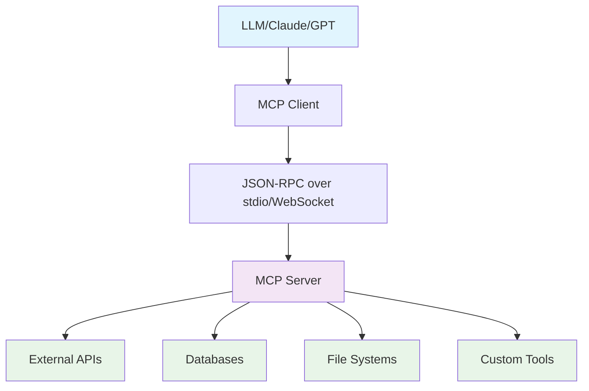
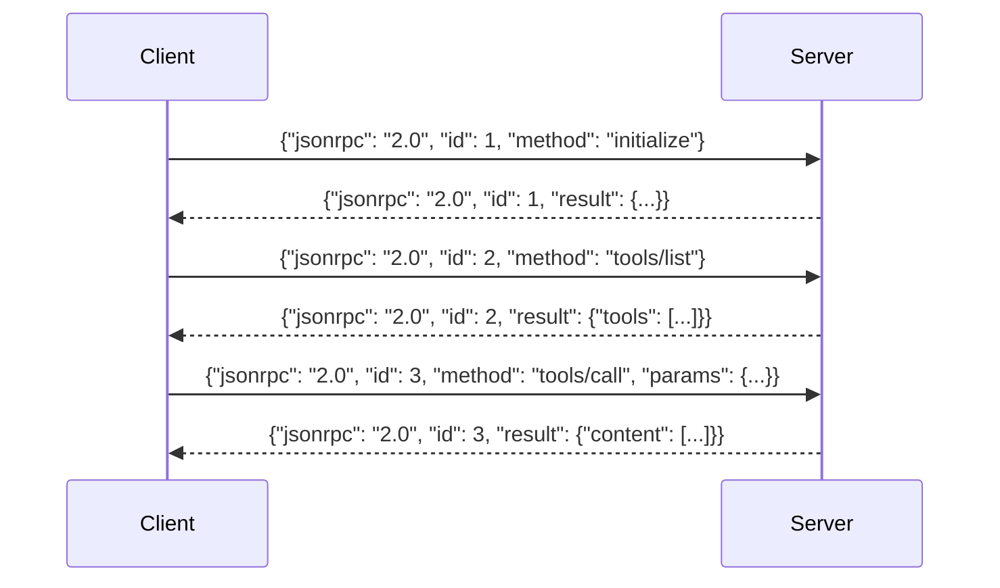
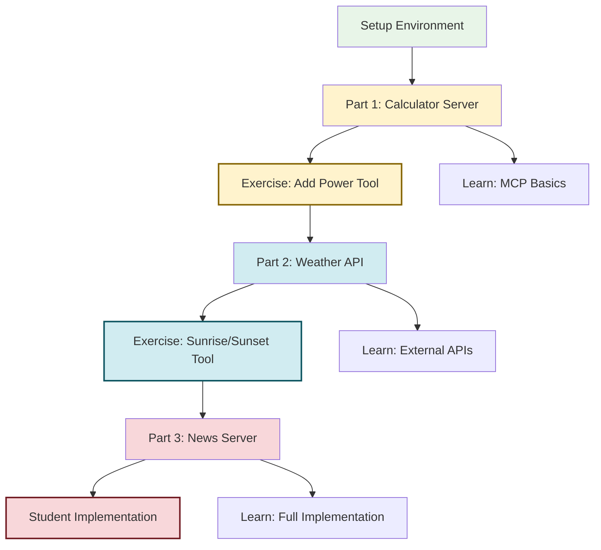
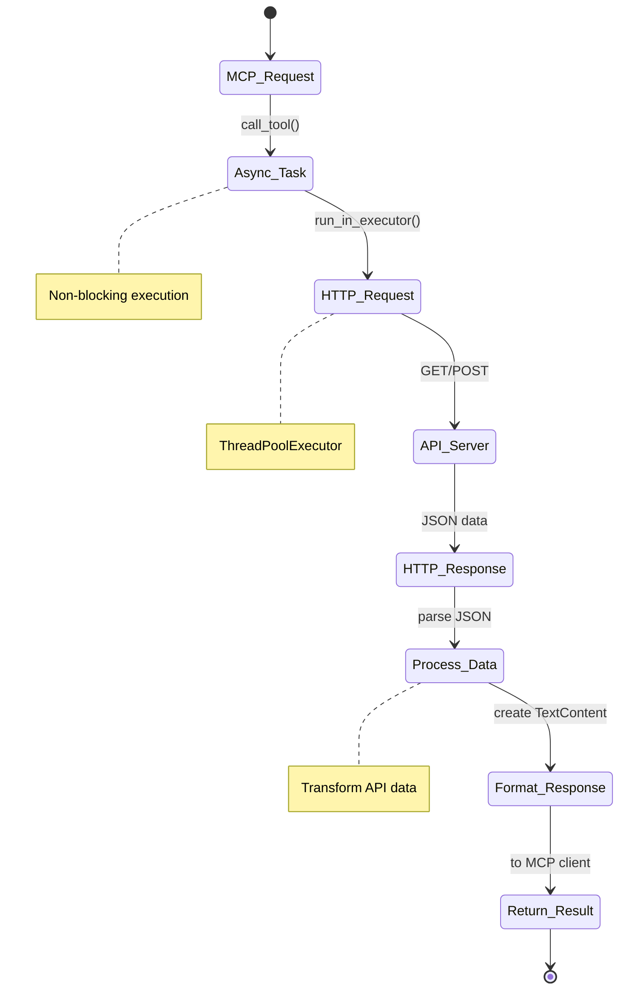
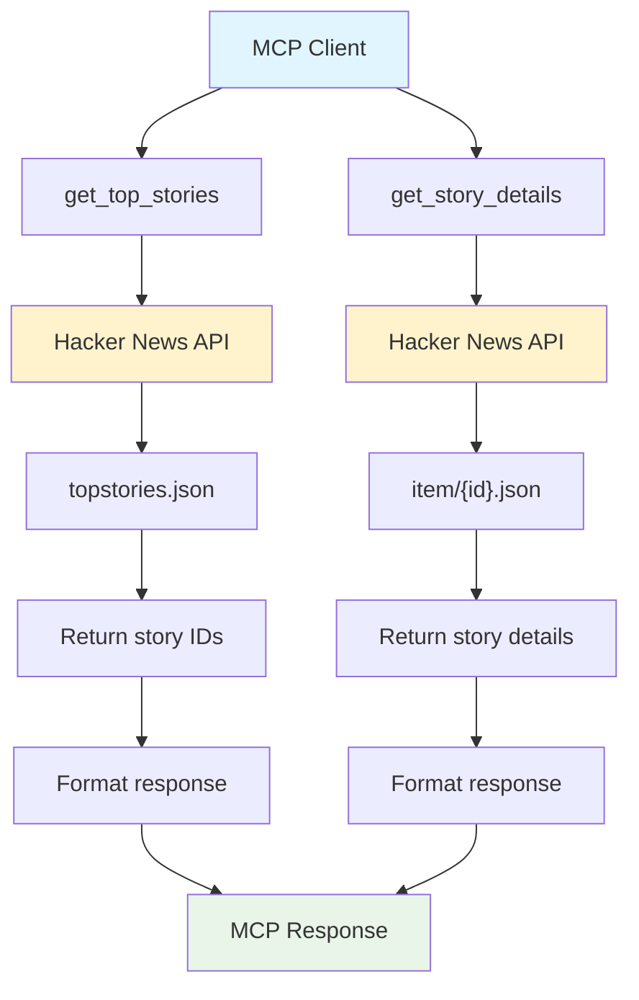
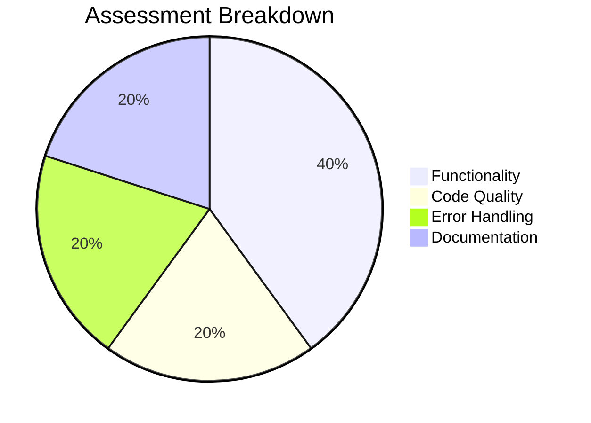

# MCP Server Development Lab
**Atlantic Technological University - AI Assisted Programming**

## Overview
In this 2-hour lab, you will learn how to build Model Context Protocol (MCP) servers that can be used by Large Language Models to access external tools and APIs.

### What is MCP?
The Model Context Protocol (MCP) is an open standard that enables LLMs to securely connect to external data sources and tools. It uses JSON-RPC 2.0 for communication between clients and servers.



**How MCP Works:**
- **MCP Client**: Usually an LLM that wants to use external tools
- **MCP Server**: Provides specific tools and handles requests
- **Communication**: JSON-RPC messages over stdio or network
- **Security**: Servers run in isolated processes, controlling data access

### MCP Protocol Flow
MCP uses JSON-RPC 2.0 messages for communication. Here's the typical flow:



**Key Protocol Elements:**
- **initialize**: Handshake establishing connection capabilities
- **tools/list**: Server tells client what tools are available
- **tools/call**: Client invokes a specific tool with parameters

> ### ⚠️ This diagram is already history
>
> The sequence above is the **stateful** model MCP used from launch until
> mid-2026, and it is what the SDK still does for you over stdio — so the
> code in this lab is correct and runs.
>
> But the [2026-07-28 specification](https://blog.modelcontextprotocol.io/posts/2026-07-28/)
> **removed the `initialize`/`initialized` handshake and the
> `Mcp-Session-Id` header entirely.** Every request now stands alone and
> carries the protocol version, client identity and capabilities in its
> `_meta`.
>
> **Why they did it** is the part worth understanding, and it has nothing
> to do with AI. A handshake means the server must remember *which client
> you are* between requests. That is fine on one machine and miserable
> behind a load balancer: every box needs shared session storage, and you
> cannot just add servers. Going stateless means a plain round-robin load
> balancer works and MCP scales like any ordinary HTTP service.
>
> **What replaced sessions:** if a tool genuinely needs state, it now
> *mints an explicit handle and returns it*, and the model passes that
> handle back as a normal argument. State became visible data instead of
> invisible transport magic.
>
> You will see both models in the wild for a while — the old HTTP+SSE
> transport is deprecated with a **year-long offramp**, not deleted. Being
> able to tell which one a server speaks is a genuinely useful skill this
> year.

### Learning Objectives
By the end of this lab, you will be able to:
- Understand the MCP architecture and JSON-RPC protocol
- Build MCP servers with custom tools
- Integrate external APIs into MCP servers
- Debug and monitor MCP communication
- Handle errors and edge cases

## Prerequisites
- Basic understanding of async/await in Python
- Familiarity with REST APIs

## Setup (10 minutes)

### 1. Create a virtual environment (recommended)
```bash
python -m venv venv
source venv/bin/activate
```

### 2. Install dependencies
```bash
pip install -r requirements.txt
```

### 3. Verify installation
```bash
python -c "import mcp; print('✅ MCP installed successfully')"
```

## Lab Structure



### Part 1: Basic Calculator Server (30 minutes)
**Location:** `part1/`

Learn the fundamentals of MCP by building a simple calculator server.

#### 🎨 Visual Demo (Optional - Start Here!)
Before diving into the code, open the interactive visual demo to see the MCP protocol in action:

```bash
cd part1
# Open mcp_demo.html in your browser
"$BROWSER" mcp_demo.html
```

This interactive webpage shows:
- **6-step animated flow** of the complete MCP protocol
- **Side-by-side visualization** of client ↔ server communication
- **Syntax-highlighted JSON messages** with detailed explanations
- **Adjustable speed controls** to learn at your own pace

Watch the demo first to understand the protocol flow, then examine the actual code!

#### Run the demo:
```bash
cd part1
python mcp_client.py
```

#### What to observe:
- **Terminal output** shows colored JSON-RPC messages with directional arrows
- **Initialization** handshake between client and server
- **Tool listing** - how tools are discovered
- **Tool execution** - how tools are called with arguments
- **Response handling** - how results are returned

Watch the colored terminal output carefully. You'll see:

1. **Initialization (Green)**
   - Client sends `initialize` request
   - Server responds with capabilities

2. **Tool Discovery (Blue)**
   - Client requests tool list with `tools/list`
   - Server returns available tools and their schemas

3. **Tool Execution (Multiple calls)**
   - Client calls tools with `tools/call`
   - Server executes and returns results
   - Note the request/response pattern

> **Watch step 1 closely — you are looking at a deprecated exchange.** The
> SDK still performs this handshake over stdio, but the 2026-07-28 spec
> removed it from the protocol. Ask yourself as it scrolls past: *what in
> this exchange does the server have to remember afterwards?* That answer
> is exactly what made MCP hard to load-balance, and exactly what the new
> spec deleted.

#### Exercise 1: Add a Power Tool
Modify `part1/mcp_server.py` to add a new tool called `power` that calculates x^y.

**Requirements:**
1. Tool should accept two parameters: `x` (base) and `y` (exponent)
2. Return result in format: "Result: 2 ^ 8 = 256"
3. Handle edge cases:
   - 0^0 should return 1 (mathematical convention)
   - Negative exponents should work
   - Large numbers should be handled

**Hints:**
- Add a new Tool in the `list_tools()` function
- Implement the logic in `call_tool()`
- Test with: `x=2, y=8` (should return 256)

**Success criteria:**
- Tool appears in tool list
- Correctly calculates power
- Handles edge cases (e.g., 0^0)

**Solution Check:**
- Tool appears in tool list
- `2^8` returns `256`
- `10^3` returns `1000`
- `5^0` returns `1`
- `2^-2` returns `0.25`

**Discussion Questions for Part 1:**
1. What is the role of `inputSchema` in the tool definition?
2. Why does the server use `stderr` for logging instead of `stdout`?
3. What happens if you call a tool that doesn't exist?
4. How would you add input validation?

### Part 2: Weather API Integration (40 minutes)
**Location:** `part2/`

Learn how to integrate external REST APIs with your MCP server.

#### What You'll Learn
- Making HTTP requests from MCP servers
- Asynchronous execution with asyncio
- External API integration patterns
- Error handling for network operations
- Data transformation and formatting



#### The wttr.in API
This lab uses [wttr.in](https://wttr.in), a free weather API that requires no authentication.

**Endpoint:** `https://wttr.in/{location}?format=j1`

**Example:**
```
https://wttr.in/Galway,Ireland?format=j1
```

Returns JSON with current conditions, forecast, and more.

#### Run the weather demo:
```bash
cd part2
python mcp_client_weather.py
```

#### What to observe:
- **External API calls** to wttr.in
- **Async execution** using asyncio
- **Error handling** for network failures
- **Data transformation** from API format to readable text

Watch the colored logs showing HTTP requests to wttr.in, raw API response data, and the async execution pattern.

#### Exercise 2: Add Sunrise/Sunset Tool
Add a new tool `get_sunrise_sunset` that fetches sunrise and sunset times for a given location.

**API**: [Sunrise-Sunset API](https://sunrise-sunset.org/api) - A free API that provides astronomical data for any location.

**Endpoint:** `https://api.sunrise-sunset.org/json?lat={latitude}&lng={longitude}&date={date}&formatted=0`

**Example:**
```
https://api.sunrise-sunset.org/json?lat=53.2707&lng=-9.0568&date=today&formatted=0
```

**Requirements:**
- Input: `latitude` (number), `longitude` (number), `date` (string, optional, default: "today")
- Output: Formatted sunrise/sunset times with day length
- Handle invalid coordinates gracefully

**Implementation Steps:**

1. **Add tool definition** in `list_tools()`:
   ```python
   Tool(
       name="get_sunrise_sunset",
       description="Get sunrise and sunset times for a location",
       inputSchema={
           "type": "object",
           "properties": {
               "latitude": {"type": "number", "minimum": -90, "maximum": 90},
               "longitude": {"type": "number", "minimum": -180, "maximum": 180},
               "date": {"type": "string", "description": "Date in YYYY-MM-DD format or 'today'"}
           },
           "required": ["latitude", "longitude"]
       }
   )
   ```

2. **Add helper function** (similar to `get_weather`):
   ```python
   import json
   import urllib.request
   
   def get_sunrise_sunset(lat: float, lng: float, date: str = "today") -> dict:
       """Fetch sunrise/sunset data"""
       log_message("🌐 EXTERNAL API CALL", {
           "api": "sunrise-sunset.org",
           "endpoint": f"https://api.sunrise-sunset.org/json?lat={lat}&lng={lng}&date={date}&formatted=0"
       })
       
       try:
           url = f"https://api.sunrise-sunset.org/json?lat={lat}&lng={lng}&date={date}&formatted=0"
           with urllib.request.urlopen(url, timeout=10) as response:
               data = json.loads(response.read().decode())
           
           log_message("✅ API RESPONSE", data)
           return data
           
       except Exception as e:
           error_info = {"error": str(e)}
           log_message("❌ API ERROR", error_info)
           return error_info
   ```

3. **Add tool implementation** in `call_tool()`:
   ```python
   elif name == "get_sunrise_sunset":
       lat = arguments["latitude"]
       lng = arguments["longitude"]
       date = arguments.get("date", "today")
       
       # Fetch data
       sun_data = await asyncio.get_event_loop().run_in_executor(
           None, get_sunrise_sunset, lat, lng, date
       )
       
       if "error" in sun_data or sun_data.get("status") != "OK":
           response_text = f"❌ Error fetching sunrise/sunset: {sun_data.get('error', 'Unknown error')}"
       else:
           results = sun_data["results"]
           # Format response with line breaks
           response_text = (
               f"🌅 Sunrise/Sunset for {lat}, {lng}\n"
               f"{'━' * 40}\n"
               f"🌅 Sunrise: {results['sunrise']} UTC\n"
               f"🌇 Sunset: {results['sunset']} UTC\n"
               f"🌞 Solar Noon: {results['solar_noon']} UTC\n"
               f"🌙 Day Length: {results['day_length']}\n"
               f"{'━' * 40}"
           )
       
       result = [TextContent(type="text", text=response_text)]
       log_message("✅ TOOL CALL RESPONSE", {"preview": response_text[:50] + "..."})
       return result
   ```

4. **Test your implementation**:
   - Galway coordinates: lat=53.2707, lng=-9.0568
   - Should return valid sunrise/sunset times

**Learning Objectives:**
- Practice external API integration with different parameter types
- Handle coordinate validation and date formatting
- Understand UTC vs local time considerations
- Reinforce async HTTP patterns

**Discussion Questions for Part 2:**
1. Why do we use `run_in_executor` for the HTTP request?
2. What would happen if the API was slow or unresponsive?
3. How could you add caching to avoid redundant API calls?
4. What security considerations exist when calling external APIs?
5. Why do coordinates use different ranges than temperatures?
6. What happens if you provide invalid coordinates?
7. How would you convert UTC times to local time zones?
8. What other astronomical APIs could complement weather data?

---

### 🎯 Bonus: Connect Your Weather Server to GitHub Copilot (15 minutes)

**See your MCP server in action with a real AI assistant!**

Now that you've built a working MCP weather server, let's connect it to GitHub Copilot in VS Code. This allows Copilot to use your weather and sunrise/sunset tools when you chat with it.

#### Step 1: Locate Your MCP Server File

First, get the absolute path to your weather server:

```bash
# In your terminal, run this from the part2 directory:
pwd
# Example output: /workspaces/aiap-w5-lab-mcp-aiap-labs-template/part2
```

Your server path will be: `/workspaces/aiap-w5-lab-mcp-aiap-labs-template/part2/mcp_server_weather.py`

#### Step 2: Open VS Code Settings

1. Press `Ctrl+,` (or `Cmd+,` on Mac) to open Settings
2. In the search bar at the top, type: `mcp servers`
3. Look for **"GitHub Copilot > Chat: Mcp Servers"**
4. Click **"Edit in settings.json"** link below it

This will open your `settings.json` file.

#### Step 3: Add Your Weather Server Configuration

Add this configuration to your `settings.json` file. If you already have `"github.copilot.chat.mcpServers"`, add the weather-server entry inside it:

```json
{
  "github.copilot.chat.mcpServers": {
    "weather-server": {
      "command": "python",
      "args": [
        "/workspaces/aiap-w5-lab-mcp-aiap-labs-template/part2/mcp_server_weather.py"
      ]
    }
  }
}
```

**Important Notes:**
- Replace the path if your workspace is in a different location
- Make sure to use the **absolute path** (starts with `/`)
- The server name `"weather-server"` can be anything you want
- Save the file with `Ctrl+S` (or `Cmd+S` on Mac)

#### Step 4: Reload VS Code

For the changes to take effect:

1. Press `Ctrl+Shift+P` (or `Cmd+Shift+P` on Mac) to open the Command Palette
2. Type: `Developer: Reload Window`
3. Press Enter

VS Code will reload with your MCP server configured.

#### Step 5: Test It with GitHub Copilot Chat

Now let's test if Copilot can use your weather tools!

1. Open **GitHub Copilot Chat** (click the chat icon in the sidebar, or press `Ctrl+Alt+I`)

2. Try these prompts and watch Copilot use your tools:

   **Example 1 - Weather Query:**
   ```
   What's the weather like in Dublin, Ireland?
   ```
   
   **Example 2 - Sunrise/Sunset Query:**
   ```
   What time is sunrise and sunset in Galway, Ireland today? 
   (Coordinates: 53.2707, -9.0568)
   ```
   
   **Example 3 - Combined Query:**
   ```
   Give me the weather and sunrise/sunset times for Paris, France.
   Coordinates for sunrise: 48.8566, 2.3522
   ```

#### Step 6: Observe the Magic! ✨

Watch what happens:

1. **Copilot analyzes your request** and determines it needs weather data
2. **Copilot discovers your tools** by calling `tools/list` on your server
3. **Copilot calls your tool** with the appropriate parameters
4. **Your server executes** and makes the API call to wttr.in or sunrise-sunset.org
5. **Copilot receives the response** and formats it nicely in natural language

You'll see indicators in the chat showing that Copilot is using your MCP server!

#### Troubleshooting

**Problem:** Copilot doesn't seem to use my tools

**Solutions:**
- Make sure you saved `settings.json` and reloaded VS Code
- Check that the path is correct and absolute (starts with `/`)
- Verify your server runs without errors: `python part2/mcp_server_weather.py`
- Look in the VS Code Output panel (View → Output) and select "GitHub Copilot" to see any error messages

**Problem:** "command not found" or Python errors

**Solutions:**
- Make sure Python is installed and accessible: `python --version`
- Verify the MCP package is installed: `pip list | grep mcp`
- Try using `python3` instead of `python` in the settings

**Problem:** Server starts but tools aren't being called

**Solutions:**
- Be specific in your Copilot prompts (mention weather, sunrise, or specific locations)
- Check that your server has implemented both tools correctly
- Try restarting VS Code completely (close and reopen)

#### What Just Happened?

🎉 **Congratulations!** You just integrated your own custom MCP server with GitHub Copilot. Here's what's significant:

1. **Real AI Integration**: Your code is now being used by a production AI assistant
2. **MCP in Action**: You've seen the full MCP protocol in action - not just in demos
3. **Tool Discovery**: Copilot automatically discovered your tools' capabilities through the `tools/list` endpoint
4. **Intelligent Tool Use**: Copilot decided when and how to use your tools based on user intent
5. **Production Pattern**: This is exactly how AI applications connect to external services in real-world systems

#### Challenge Questions

Now that you've seen MCP with Copilot:

1. **Try asking Copilot complex questions** that require multiple tool calls
2. **What happens if you ask for weather in an invalid location?** Does Copilot handle the error gracefully?
3. **Can you modify your server** to add a new tool and see Copilot discover it automatically?
4. **Compare responses**: Ask Copilot the same question with and without your server configured. Notice the difference?

#### Going Further

Want to take this further? Try:

- **Add more tools** to your server (temperature conversion, weather alerts, etc.)
- **Improve error messages** so Copilot can give better responses to users
- **Add input validation** to prevent invalid API calls
- **Create a different MCP server** (e.g., the calculator from Part 1) and configure both
- **Experiment with tool descriptions** - they affect when Copilot chooses to use your tools

**Pro Tip:** The tool descriptions in your `list_tools()` function are crucial! They tell Copilot when to use each tool. Make them clear and specific.

---

### Part 3: Student Project - News Headline Fetcher (40 minutes)
**Location:** `part3_student_exercise/`

Build a complete MCP server from scratch that fetches news headlines.

#### What You'll Learn
- Building MCP servers from scratch
- Integrating with external APIs
- Handling complex data structures
- Implementing multiple tools
- Error handling and validation



#### API Information
You'll use the Hacker News API (no API key required):
- Top stories: `https://hacker-news.firebaseio.com/v0/topstories.json`
- Story details: `https://hacker-news.firebaseio.com/v0/item/{id}.json`

#### Required Tools

**1. `get_top_stories`**
- Description: Get the top N story IDs from Hacker News
- Parameters:
  - `count` (number, optional, default: 5): Number of stories to fetch (1-10)
- Returns: List of story IDs

**2. `get_story_details`**
- Description: Get detailed information for a story
- Parameters:
  - `story_id` (number, required): The story ID
- Returns: Story title, author, score, URL, and time posted

#### Implementation Steps

1. **Start with the template:**
   Open `part3_student_exercise/student_news_mcp_server.py`

2. **Implement `list_tools()`:**
   - Define both tools with proper schemas
   - Use the correct JSON Schema types and validation

3. **Implement `call_tool()`:**
   - Handle both tool calls
   - Make HTTP requests to the Hacker News API
   - Format the response nicely
   - Handle errors (invalid IDs, network issues, etc.)

4. **Add logging:**
   - Use the `log_message()` function provided
   - Log API calls and responses
   - Help with debugging

5. **Test your server:**
   ```bash
   cd part3_student_exercise
   python student_news_mcp_client.py
   ```

#### Helper Functions Implementation

**Function 1: `fetch_top_stories(count: int) -> list`**

```python
import json
import urllib.request
import sys

def fetch_top_stories(count: int = 5) -> list:
    """Fetch top story IDs from Hacker News"""
    try:
        # Validate count
        count = max(1, min(count, 10))  # Clamp between 1-10
        
        # Make API request
        url = "https://hacker-news.firebaseio.com/v0/topstories.json"
        with urllib.request.urlopen(url, timeout=10) as response:
            all_ids = json.loads(response.read().decode())
        
        # Return top N
        return all_ids[:count]
        
    except Exception as e:
        print(f"Error fetching stories: {e}", file=sys.stderr)
        return []
```

**Function 2: `fetch_story_details(story_id: int) -> dict`**

```python
def fetch_story_details(story_id: int) -> dict:
    """Fetch details for a specific story"""
    try:
        url = f"https://hacker-news.firebaseio.com/v0/item/{story_id}.json"
        with urllib.request.urlopen(url, timeout=10) as response:
            story = json.loads(response.read().decode())
        
        # Handle missing fields
        if not story:
            return {"error": "Story not found"}
        
        return {
            "title": story.get("title", "No title"),
            "author": story.get("by", "Unknown"),
            "score": story.get("score", 0),
            "url": story.get("url", "No URL"),
            "id": story_id
        }
        
    except Exception as e:
        return {"error": str(e)}
```

#### Tool Definitions

```python
tools = [
    Tool(
        name="get_top_stories",
        description="Get the top N story IDs from Hacker News",
        inputSchema={
            "type": "object",
            "properties": {
                "count": {
                    "type": "number",
                    "description": "Number of stories (1-10)",
                    "minimum": 1,
                    "maximum": 10,
                    "default": 5
                }
            }
        }
    ),
    Tool(
        name="get_story_details",
        description="Get detailed information about a story",
        inputSchema={
            "type": "object",
            "properties": {
                "story_id": {
                    "type": "number",
                    "description": "The Hacker News story ID"
                }
            },
            "required": ["story_id"]
        }
    )
]
```

#### Tool Execution Implementation

```python
if name == "get_top_stories":
    count = arguments.get("count", 5)
    
    # Fetch stories
    story_ids = await asyncio.get_event_loop().run_in_executor(
        None, fetch_top_stories, count
    )
    
    if not story_ids:
        response_text = "❌ Failed to fetch stories"
    else:
        response_text = f"📰 Top {len(story_ids)} Hacker News Stories:\n"
        for i, story_id in enumerate(story_ids, 1):
            response_text += f"{i}. Story ID: {story_id}\n"
    
    result = [TextContent(type="text", text=response_text)]
    
elif name == "get_story_details":
    story_id = arguments["story_id"]
    
    # Fetch story details
    story = await asyncio.get_event_loop().run_in_executor(
        None, fetch_story_details, story_id
    )
    
    if "error" in story:
        response_text = f"❌ Error: {story['error']}"
    else:
        response_text = (
            f"📰 Story Details\n"
            f"{'━' * 21}\n"
            f"Title: {story['title']}\n"
            f"Author: {story['author']}\n"
            f"Score: {story['score']} points\n"
            f"URL: {story['url']}\n"
            f"{'━' * 21}"
        )
    
    result = [TextContent(type="text", text=response_text)]
```

#### Example Output Format

**get_top_stories:**
```
Top 5 Hacker News Stories:
1. Story ID: 38194773
2. Story ID: 38194521
3. Story ID: 38194102
...
```

**get_story_details:**
```
📰 Story Details
━━━━━━━━━━━━━━━━━━━━━
Title: Example Story Title
Author: username
Score: 342 points
URL: https://example.com
━━━━━━━━━━━━━━━━━━━━━
```

## Deliverables

### Required:
1. ✅ Working `student_news_mcp_server.py` that passes validation
2. ✅ Screenshot of JSON-RPC traffic showing tool execution
3. ✅ Brief write-up (200 words) in `WRITEUP.md` explaining:
   - The MCP communication flow
   - How tools are discovered and executed
   - Challenges you encountered

### Submission:
Create a folder with your student ID and include:
- `student_news_mcp_server.py`
- `WRITEUP.md`
- `screenshot.png`

## Bonus Challenges (if time permits)

### Part 1 Challenges
- Add more mathematical operations (square root, logarithms, etc.)
- Implement input validation for edge cases
- Add support for complex numbers

### Part 2 Challenges
1. **Add Time Zone Support**
   - Convert UTC sunrise/sunset times to local time zones
   - Add a `timezone` parameter (e.g., "Europe/Dublin")
   - Use Python's `pytz` or `datetime` for conversion

2. **Validation**
   - Reject invalid coordinates (outside -90/+90 lat, -180/+180 lng)
   - Validate date format (YYYY-MM-DD)
   - Return helpful error messages for invalid inputs

3. **Integration**
   - Modify `get_weather` to include sunrise/sunset times
   - Add a parameter to include astronomical data with weather
   - Combine weather and sun data in a single response

4. **Additional API Integration** (Advanced)
   - Add more external APIs to your weather server
   - Try integrating with other free APIs like random quotes or jokes
   - Or integrate with other weather services (OpenWeatherMap, etc.)
   - Compare API response formats and error handling

### Part 3 Challenges

#### Challenge 1: Caching (Easy)
Add a simple dictionary cache to avoid redundant API calls:
```python
story_cache = {}

def fetch_story_details(story_id: int) -> dict:
    if story_id in story_cache:
        return story_cache[story_id]
    
    # ... fetch from API ...
    
    story_cache[story_id] = story
    return story
```

#### Challenge 2: Search Tool (Medium)
Add a `search_stories` tool that:
- Fetches top 50 stories
- Gets details for each
- Filters by keyword in title
- Returns matching stories

#### Challenge 3: Time Formatting (Easy)
Convert Unix timestamps to human-readable format:
```python
from datetime import datetime

timestamp = 1175714200
dt = datetime.fromtimestamp(timestamp)
formatted = dt.strftime("%Y-%m-%d %H:%M:%S")
```

#### Challenge 4: Rate Limiting (Hard)
Implement rate limiting (max 5 requests/second):
```python
import time

last_request_times = []

def rate_limited_request(url):
    now = time.time()
    # Remove requests older than 1 second
    last_request_times[:] = [t for t in last_request_times if now - t < 1]
    
    if len(last_request_times) >= 5:
        sleep_time = 1 - (now - last_request_times[0])
        time.sleep(sleep_time)
    
    last_request_times.append(time.time())
    # ... make request ...
```

## Troubleshooting

### Common Issues

**Problem:** `ModuleNotFoundError: No module named 'mcp'`
**Solution:** Make sure you installed dependencies: `pip install -r requirements.txt`

**Problem:** Server hangs or doesn't respond
**Solution:** Check stderr output for error messages. Make sure async/await is used correctly.

**Problem:** JSON decode errors
**Solution:** Verify the API endpoint is correct and returning valid JSON.

**Problem:** Network timeout errors
**Solution:** Check your internet connection. The APIs should be accessible without VPN.

### Detailed Troubleshooting by Part

#### Part 1 Specific Issues
**Problem:** Power tool doesn't appear in tool list
**Solution:** Make sure you added the Tool definition in `list_tools()` and restarted the server.

**Problem:** Power calculation gives wrong results
**Solution:** Check your implementation in `call_tool()`. Remember that `0^0 = 1` by mathematical convention.

#### Part 2 Specific Issues
**Problem:** `urllib.error.URLError: <urlopen error timed out>`
**Solution:** Network issues or slow API. The code has a 10-second timeout.

**Problem:** Invalid location returns error
**Solution:** This is expected behavior. Try common city names like "London" or "Paris".

**Problem:** API returns unexpected format
**Solution:** The wttr.in API is generally stable, but APIs can change. Check the response structure.

**Problem:** Sunrise/sunset tool returns error for valid coordinates
**Solution:** Check coordinate ranges: latitude -90 to +90, longitude -180 to +180. Ensure coordinates are floats.

**Problem:** UTC times are confusing for students
**Solution:** Explain that APIs often return UTC, and local time conversion would require additional timezone handling.

#### Part 3 Specific Issues
**Problem:** `urllib.error.HTTPError: HTTP Error 404`
**Solution:** Story ID doesn't exist. The validator uses ID 8863 which is valid.

**Problem:** Server doesn't respond
**Solution:** Check for syntax errors. Make sure all `async`/`await` keywords are correct.

**Problem:** Tests fail but code looks correct
**Solution:** Check the response format. Validator looks for specific patterns.

**Problem:** `json.JSONDecodeError`
**Solution:** Check that you're requesting the JSON format from the API.

### Getting Help
- Check the example implementations in `part1/`, `part2/`, and `solutions/`
- Review the MCP documentation: https://modelcontextprotocol.io
- Ask your instructor or lab demonstrator

## Additional Resources

- **MCP Documentation:** https://modelcontextprotocol.io/docs
- **MCP Python SDK:** https://github.com/modelcontextprotocol/python-sdk
- **Hacker News API:** https://github.com/HackerNews/API
- **wttr.in API:** https://github.com/chubin/wttr.in
- **Sunrise-Sunset API:** https://sunrise-sunset.org/api

## Assessment Criteria



Your work will be assessed on:
- **Functionality (40%)**: Does the server work correctly?
- **Code Quality (20%)**: Is the code clean, readable, and well-organized?
- **Error Handling (20%)**: Are edge cases and errors handled properly?
- **Documentation (20%)**: Is the write-up clear and demonstrates understanding?

## License
This lab material is provided for educational purposes at Atlantic Technological University.

---

**Lab created by:** AI Assisted Programming Module  
**Academic Year:** 2024/2025  
**Duration:** 2 hours  
**Difficulty:** Intermediate
